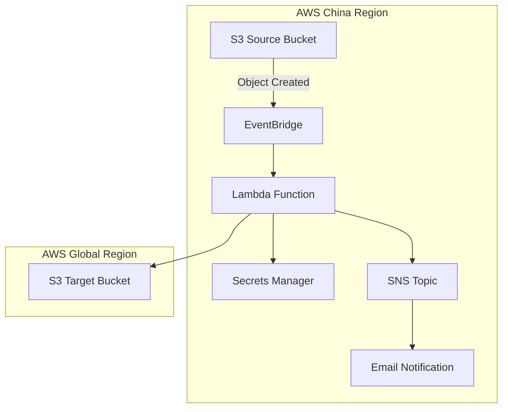

# 🌐 S3 Cross-Partition Sync

[](https://aws.amazon.com/cloudformation/)
[](https://www.python.org/)
[](LICENSE)
[](https://github.com/yourusername/s3-cross-partition-sync/graphs/commit-activity)

> 🚀 **Automated S3 object synchronization between AWS China and Global regions using EventBridge and Lambda**

## 📋 Table of Contents

- [Overview](#-overview)
- [Features](#-features)
- [Architecture](#-architecture)
- [Prerequisites](#-prerequisites)
- [Quick Start](#-quick-start)
- [Configuration](#-configuration)
- [Deployment](#-deployment)
- [Testing](#-testing)
- [Monitoring](#-monitoring)
- [Troubleshooting](#-troubleshooting)
- [Contributing](#-contributing)
- [License](#-license)

## 🎯 Overview

This CloudFormation template provides an automated solution for synchronizing S3 objects between AWS China regions and AWS Global regions. It uses EventBridge to detect S3 object creation events and triggers a Lambda function to copy objects across partitions.

### Key Benefits

- ✅ **Real-time sync** - Automatic triggering on S3 object creation
- 🔒 **Secure** - Cross-account credentials stored in AWS Secrets Manager
- 📊 **Scalable** - Dynamic Lambda configuration based on file sizes
- 🔄 **Reliable** - Built-in retry mechanism with exponential backoff
- 📧 **Alerting** - Optional SNS email notifications for failures
- 🎯 **Flexible** - Configurable S3 prefix filtering

## ⭐ Features

| Feature | Description |
|---------|-------------|
| **Cross-Partition Sync** | Sync between China (cn-*) and Global regions |
| **EventBridge Integration** | Real-time S3 event processing |
| **Dynamic File Handling** | Memory vs /tmp processing based on file size |
| **Retry Mechanism** | Configurable retry attempts (2-10) with exponential backoff |
| **Prefix Filtering** | Sync only specific S3 folders/prefixes |
| **SNS Notifications** | Email alerts for sync failures |
| **Multi-Size Support** | Optimized for files up to 10GB |

## 🏗️ Architecture



## 📋 Prerequisites

- AWS CLI configured for both source and target regions
- Cross-account IAM credentials for target region
- S3 buckets in source and target regions
- Email address for failure notifications (optional)

### Supported Regions

**Source Regions (China):**
- `cn-north-1` (Beijing)
- `cn-northwest-1` (Ningxia)

**Target Regions (Global):**
- All major AWS Global regions supported

## 🚀 Quick Start

### 1. Clone Repository

```bash
git clone https://github.com/yourusername/s3-cross-partition-sync.git
cd s3-cross-partition-sync
```

### 2. Deploy CloudFormation Stack

```bash
aws cloudformation create-stack \
  --stack-name s3-cross-partition-sync \
  --template-body file://s3-cross-account-sync-minimal-template.yaml \
  --parameters \
    ParameterKey=SourceRegion,ParameterValue=cn-north-1 \
    ParameterKey=TargetRegion,ParameterValue=us-east-1 \
    ParameterKey=SourceBucketName,ParameterValue=my-source-bucket \
    ParameterKey=TargetBucketName,ParameterValue=my-target-bucket \
    ParameterKey=MaxFileSizeCategory,ParameterValue=Under200MB \
  --capabilities CAPABILITY_IAM
```

### 3. Configure S3 EventBridge

```bash
aws s3api put-bucket-notification-configuration \
  --bucket my-source-bucket \
  --notification-configuration '{"EventBridgeConfiguration": {}}'
```

### 4. Set Up Target Credentials

Store target account credentials in Secrets Manager:

```json
{
  "AccessKeyId": "AKIA...",
  "SecretAccessKey": "..."
}
```

## ⚙️ Configuration

### File Size Categories

| Category | Max File Size | Lambda Memory | /tmp Storage | Timeout | Processing Mode |
|----------|---------------|---------------|--------------|---------|-----------------|
| **Under200MB** | 200MB | 256MB | - | 180s | Memory |
| **200MB-2GB** | 2GB | 512MB | 3GB | 600s | /tmp Directory |
| **2GB-10GB** | 10GB | 1024MB | 10GB | 900s | /tmp Directory |

### Parameters

| Parameter | Type | Default | Description |
|-----------|------|---------|-------------|
| `SourceRegion` | String | Required | Source AWS China region |
| `TargetRegion` | String | Required | Target AWS Global region |
| `SourceBucketName` | String | Required | Source S3 bucket name |
| `TargetBucketName` | String | Required | Target S3 bucket name |
| `MaxFileSizeCategory` | String | Required | File size category for Lambda config |
| `S3PrefixFilter` | String | Optional | S3 prefix filter (e.g., "documents/") |
| `RetryAttempts` | Number | 3 | Retry attempts (2-10) |
| `EnableSNSNotification` | Boolean | false | Enable failure notifications |
| `NotificationEmail` | String | Optional | Email for failure notifications |

## 🚀 Deployment

### Using AWS CLI

```bash
# Deploy with basic configuration
aws cloudformation deploy \
  --template-file s3-cross-account-sync-minimal-template.yaml \
  --stack-name s3-sync \
  --parameter-overrides \
    SourceRegion=cn-north-1 \
    TargetRegion=us-west-2 \
    SourceBucketName=source-bucket \
    TargetBucketName=target-bucket \
    MaxFileSizeCategory=200MB-2GB \
    S3PrefixFilter=documents/ \
    EnableSNSNotification=true \
    NotificationEmail=admin@example.com \
  --capabilities CAPABILITY_IAM
```

### Using AWS Console

1. Open AWS CloudFormation Console
2. Click "Create Stack"
3. Upload `s3-cross-account-sync-minimal-template.yaml`
4. Fill in parameters
5. Review and create

## 🧪 Testing

### Manual Test

```bash
# Test sync function directly
aws lambda invoke \
  --function-name YourSyncFunction \
  --payload '{"test_key":"test/sample.txt"}' \
  response.json

# Check response
cat response.json
```

### Upload Test File

```bash
# Upload a test file to source bucket
aws s3 cp test-file.txt s3://source-bucket/test/
```

## 📊 Monitoring

### CloudWatch Logs

Monitor Lambda execution logs:

```bash
aws logs describe-log-groups --log-group-name-prefix /aws/lambda/
```

### CloudWatch Metrics

Key metrics to monitor:
- Lambda invocations
- Lambda errors
- Lambda duration
- S3 object count in target bucket

### SNS Notifications

Failed sync operations will send email notifications with:
- Object key
- Error details
- Retry attempts
- Timestamp

## 🔧 Troubleshooting

### Common Issues

| Issue | Cause | Solution |
|-------|-------|----------|
| **Lambda timeout** | Large file processing | Increase timeout or use larger file size category |
| **Permission denied** | Invalid target credentials | Update Secrets Manager secret |
| **EventBridge not triggering** | S3 EventBridge not enabled | Run S3 notification configuration command |
| **Prefix filter not working** | Incorrect prefix format | Ensure prefix doesn't start with "/" |

### Debug Commands

```bash
# Check stack status
aws cloudformation describe-stacks --stack-name s3-sync

# View Lambda logs
aws logs tail /aws/lambda/your-function-name --follow

# Test connectivity
aws s3 ls s3://target-bucket --region us-west-2
```

## 🤝 Contributing

1. Fork the repository
2. Create a feature branch (`git checkout -b feature/amazing-feature`)
3. Commit your changes (`git commit -m 'Add amazing feature'`)
4. Push to the branch (`git push origin feature/amazing-feature`)
5. Open a Pull Request

### Development Setup

```bash
# Clone repository
git clone https://github.com/yourusername/s3-cross-partition-sync.git
cd s3-cross-partition-sync

# Create backup before changes
cp s3-cross-account-sync-minimal-template.yaml backup/
```

## 📞 Support

- 📧 Email: hzhaoam@nwcdcloud.cn
- 💬 Issues: [GitHub Issues](https://github.com/yourusername/s3-cross-partition-sync/issues)
- 📖 Documentation: [Wiki](https://github.com/yourusername/s3-cross-partition-sync/wiki)

---

⭐ **Star this repository if it helped you!** ⭐ 